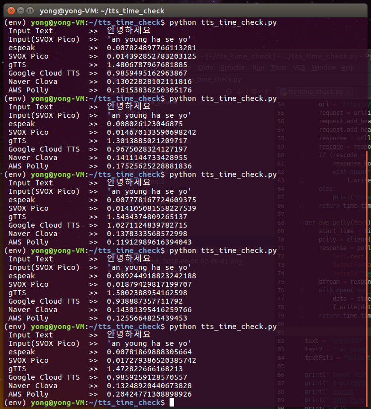
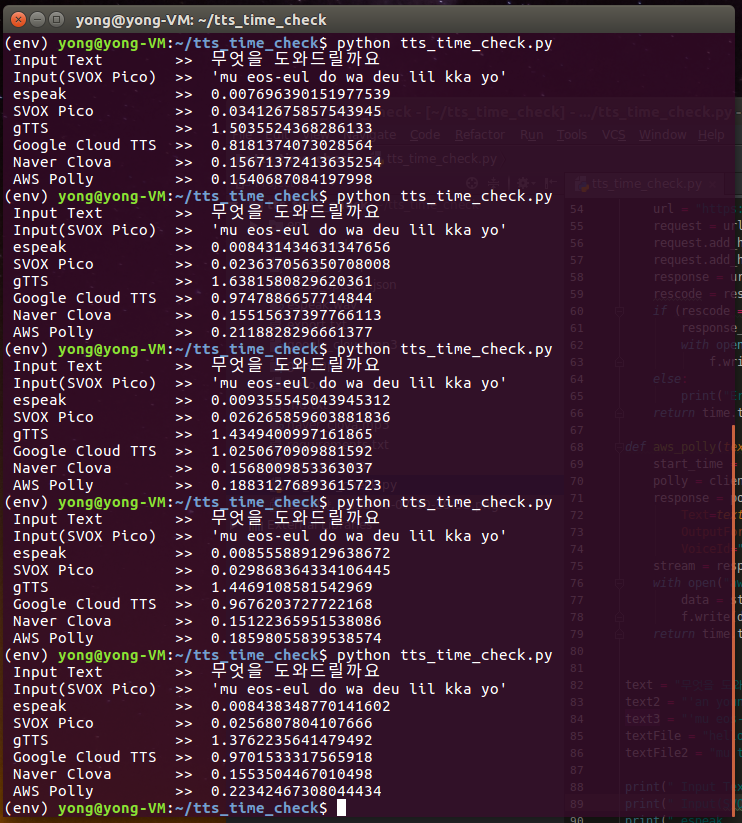

# TTS Time Check
텍스트를 입력하여 TTS엔진 및 API요청에 의해 음성파일이 생성되기까지의 시간 측정.

#### 1. TTS엔진 및 API
```
- espeak engine     : 우분투에서 espeak 패키지 설치후, 사용
- SVOX Pico engine  : 우분투에서 libttsapico-utils 패키지 설치후, 사용
- gTTS              : 파이썬 패지키 설치를 통해 무료로 사용
- Google Cloud TTS  : 구글 클라우드 플랫폼에서 서비스 계정 키를 받아 사용 (4달러/100만자)
- Naver Clova TTS   : 네이버 클라우드 플랫폼에서 서비스 계정 키를 받아 사용 (4원/1000글자)
- AWS Polly TTS     : 아마존 웹 서비스에서 엑세스 키를 받아 사용 (4달러/100만자)
```

#### 2. 텍스트 입력
```
- '안녕하세요'
- '무엇을 도와드릴까요'
```

#### 3. SVOX Pico 엔진
```
- SVOX Pico 엔진은 한국어 지원이 되지않아 '안녕하세요'의 경우 'an young ha se yo'로 변형 (한글 영문 표기법 참고)
- '무엇을 도와드릴까요' --> 'mu eos-eul do wa deu lil kka yo'
```

#### 4. 녹음된 음성파일 확인
```
- espeak           : espeak.wav
- SVOX Pico        : svox_pico.wav
- gTTS             : gtts.mp3
- Google Cloud TTS : google_cloud.mp3
- Naver Clova TTS  : naver_clova.mp3
- AWS Polly TTS    : aws_polly.mp3
```

#### 5. 결과
```
- 각각 5회씩 테스트
- 단위는 초(sec)
```
<div align='center'>
  
</div>
<div align='center'>
  
</div>
